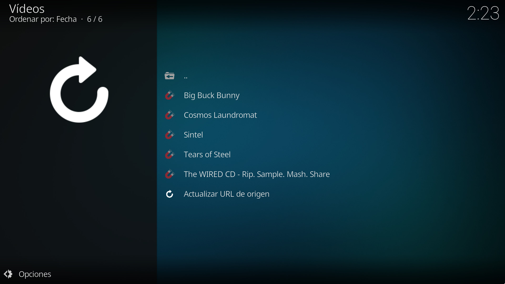
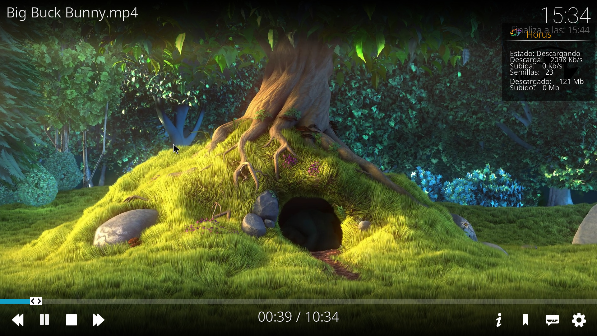
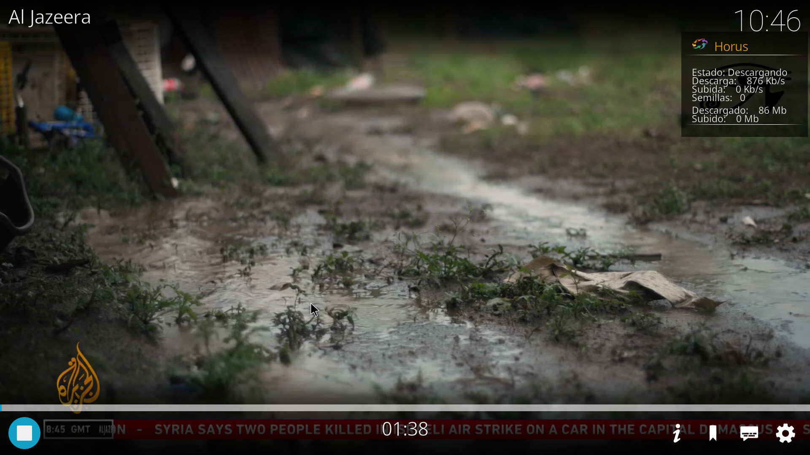

# Extractor

Extractor es un addon para Kodi que permite acceder a contenido público y legal a través de enlaces de streaming. Su diseño sencillo facilita la extracción de enlaces de video desde diversas fuentes, ofreciendo a los usuarios una forma rápida y eficiente de disfrutar de su contenido favorito. Este addon es totalmente gratuito, y por lo tanto, está prohibida su venta individual o preinstalada en cualquier dispositivo. Es para uso personal y privado. Extractor es un proyecto sin ánimo de lucro.

## Características

- Soporte para enlaces Magnet.
- Soporte para enlaces Acestream.
- Extracción de streams de listas M3U.
- Interfaz fácil de usar para cambiar la URL de origen.

## Instalación

### Opción 1: Desde el archivo ZIP

1. Descargue el archivo ZIP del addon desde la sección de [Releases](docs/).
2. En Kodi, vaya al "Explorador de add-ons" y seleccione "Instalar desde un archivo .zip".
3. Vaya hasta el archivo ZIP que descargó anteriormente e instálelo.

### Opción 2: Desde el repositorio

1. Vaya al "Explorador de archivos" de Kodi.
2. Haga clic en "Añadir fuente".
3. La ruta de la fuente es <code class="code-highlight">https://junji-1.github.io/Extractor/</code>.
4. Nómbrelo "Extractor" sin las comillas.
5. Dirígase al "Explorador de add-ons".
6. Seleccione "Instalar desde un archivo .zip".
7. Cuando le solicite la ubicación, seleccione "Extractor" e instale la versón deseada.
8. Si se trata de una actualización de Extractor es recomendable reiniciar Kodi.

## Uso

1. Abra el addon en Kodi.
2. Introduzca la URL de origen desde donde deseas extraer los enlaces.
3. Explore los streams y seleccione el que desea reproducir.

## Aviso

No apoyamos ni promovemos el acceso a contenido ilegal.

## Historial de Cambios

Para ver los cambios realizados en cada versión, consulta el archivo [CHANGELOG.md](docs/CHANGELOG.md).

## Licencia

Este addon está licenciado bajo la Licencia Pública General GNU v3.0. Para más detalles, consulta el archivo LICENSE.

## Contribuciones

Las contribuciones son bienvenidas. Por favor, abre un `issue` para discutir cualquier cambio que desees proponer.

## Contacto

Si tienes preguntas o sugerencias, no dudes en contactarme a través de GitHub.

## Capturas de pantalla

<table>
  <tr>
    <td></td>
    <td></td>
    <td></td>
  </tr>
</table>
